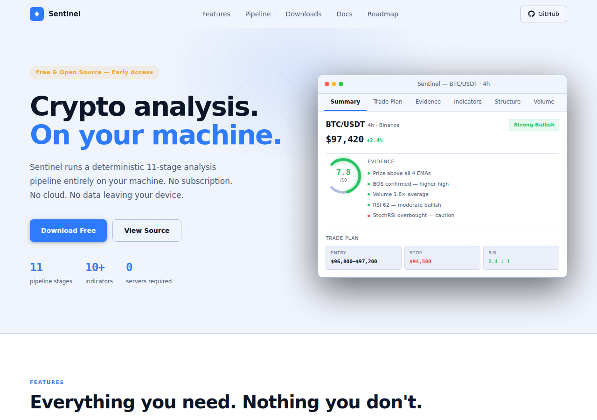
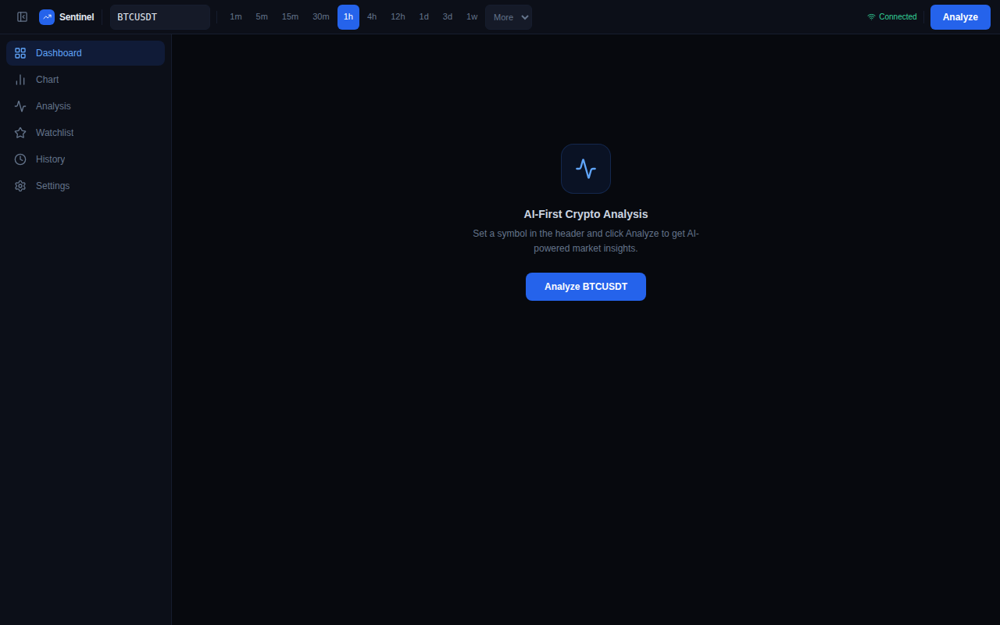
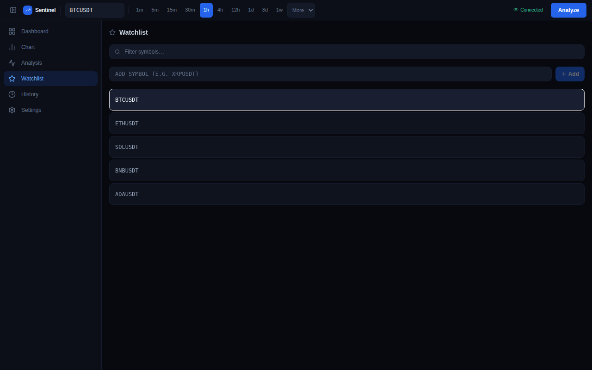

# Sentinel

**Crypto analysis. On your machine. No subscription, no cloud, no data leaving your device.**

Sentinel is a **desktop application** for Windows, macOS, and Linux. It runs a deterministic 11-stage analysis pipeline — indicators, market structure, volume, support/resistance, confidence scoring, and a trade plan — entirely on your device. Same input always produces the same output, to the decimal.

[](https://github.com/fakej3/Sentinel/releases/latest)
[](https://github.com/fakej3/Sentinel/actions/workflows/release.yml)
[](desktop/docs/TESTING_STRATEGY.md)
[](LICENSE)

**[→ Download](https://github.com/fakej3/Sentinel/releases/latest)** &nbsp;·&nbsp; **[→ Web App](web/)** &nbsp;·&nbsp; **[→ Docs](desktop/docs/)**

---



---

## Features

- **11-stage deterministic pipeline** — candle fetch → indicators → market structure → support/resistance → volume analysis → trend synthesis → evidence builder → validation → confidence scoring → trade plan → writer; same input always produces the same output
- **10+ technical indicators** — EMA 9/21/50/200, RSI, MACD, ATR, ADX, Bollinger Bands, StochRSI, OBV, MFI, CCI — computed from first principles, not approximated
- **Evidence-weighted confidence score** — 0–10 with letter grade A–F; cross-module contradiction detection automatically flags conflicting signals
- **Structured trade plans** — entry zone, stop loss, three profit targets, risk/reward ratio, and a setup maturity score
- **Market structure detection** — Higher Highs/Higher Lows/Lower Highs/Lower Lows, Break of Structure, Change of Character, pullback and consolidation identification
- **Volume analysis** — buy/sell pressure ratios, volume climax detection, VWAP deviation, Accumulation/Distribution, OBV divergence from price
- **Support & resistance zones** — pivot-based zone detection, strength scoring, and EMA/VWAP confluence mapping
- **Optional Gemini AI narration** — after all computation completes, Gemini writes prose from the finished result; it never calculates or invents a number
- **Local analysis history** — every analysis stored in AppData; review past setups, track confidence across timeframes
- **Offline after first fetch** — only Binance (candles) and Google (Gemini, if enabled) are called externally; everything else runs on your machine
- **1,531 tests across 77 files** — every module covered; determinism enforced by the test suite
- **MIT licensed** — full source available; audit every line of analysis logic

---

## Screenshots

**Dashboard**



**Watchlist**



---

## Why Sentinel

**Deterministic by design.**
Every indicator uses its published formula. Every evidence item maps to a documented rule. Given the same candle data, you always get the same result — to the decimal. No randomness, no heuristics, no hidden weights that drift between runs.

**The AI only writes.**
Gemini receives a fully computed `PipelineResult` and converts it into prose. It does not calculate, does not decide, and cannot invent a number. Every value in the output has a deterministic source in the pipeline, traceable to a specific stage.

**Your data stays local.**
There are no Sentinel servers. Analysis results, history, API keys, and settings are stored in your machine's AppData. The only outbound calls are to Binance (for candles) and Google (if you enable Gemini). Nothing is routed through a third party.

**Auditable pipeline.**
Every stage of the analysis is open source. You can read the code that produced each indicator value, each evidence item, each confidence score. Nothing is behind an API or a proprietary black box. Every numeric threshold has a documented rule in [`ENGINE_RULES.md`](desktop/docs/ENGINE_RULES.md).

---

## Download

Installers are built automatically by GitHub Actions on every version tag.

| Platform | Formats |
|----------|---------|
| **Windows** | `.msi` installer · `.exe` setup |
| **macOS** | `.dmg` universal (Apple Silicon + Intel) |
| **Linux** | `.deb` (Debian/Ubuntu) · `.rpm` (Fedora/RHEL) · `.AppImage` (universal) |

**[→ Download latest release](https://github.com/fakej3/Sentinel/releases/latest)**

---

## Documentation

All technical documentation is in [`desktop/docs/`](desktop/docs/).

| Document | Description |
|----------|-------------|
| [Architecture](desktop/docs/ARCHITECTURE.md) | Pipeline design, module contracts, data flow diagram |
| [Pipeline](desktop/docs/PIPELINE.md) | Stage-by-stage breakdown with inputs and outputs |
| [Engine Rules](desktop/docs/ENGINE_RULES.md) | Every threshold and weight with its documented rule |
| [Testing Strategy](desktop/docs/TESTING_STRATEGY.md) | Test structure and quality gates |
| [Local Development](desktop/docs/LOCAL_DEVELOPMENT.md) | Setup guide for building from source |
| [Roadmap](desktop/docs/ROADMAP.md) | Planned features and delivery timeline |
| [Changelog](desktop/docs/CHANGELOG.md) | What changed in each release |
| [Versioning](desktop/docs/VERSIONING.md) | Release process and tagging convention |
| [Known Limitations](desktop/docs/KNOWN_LIMITATIONS.md) | Accepted tradeoffs and deferred work |

---

## FAQ

**Is Sentinel free?**
Yes, and permanently. Sentinel is MIT licensed. The analysis engine is open source and will always be free. Future paid additions (if any) would be optional cloud features — the desktop app stays free.

**Does Sentinel use AI to make trading decisions?**
No. The 11-stage pipeline is entirely deterministic. Indicators use published formulas. Market structure follows documented rules. Confidence is computed from evidence items using fixed weights. The optional Gemini integration is a writer — it formats the finished result into prose. It never drives the analysis.

**Does anything leave my machine?**
Two things: Binance API calls to fetch candle data, and Gemini API calls if you enable AI narration. Your analysis results, history, settings, and any API keys are stored locally in AppData. Nothing is sent to Sentinel servers — there are no Sentinel servers.

**Which exchanges are supported?**
Currently Binance — both spot and USD-M futures pairs. The architecture is exchange-agnostic; adding a new exchange means implementing a single fetch adapter. Bybit, Coinbase Advanced, OKX, and Kraken are on the roadmap.

**Is there a web app?**
Yes — `web/` is a browser-native version of the same analysis engine. It runs the full pipeline client-side with no backend; analysis never leaves your browser. Deploy it to Vercel by following the instructions in [`web/DEPLOYMENT.md`](web/DEPLOYMENT.md). The desktop app additionally gives you a local database, offline access after the first candle fetch, and native OS integration.

**How is confidence calculated?**
Each analysis module produces typed evidence items with a direction (bull/bear/neutral) and impact (strong/moderate/weak). The confidence engine sums bull vs bear evidence, weights by impact, checks for contradictions, and applies a data completeness penalty. Score is 0–10. Grades: A (≥8.5), B (≥7.0), C (≥5.0), D (≥3.0), F (<3.0).

---

## Development

### Prerequisites

| Tool | Version |
|------|---------|
| Node.js | 20+ |
| Rust | stable ([rustup.rs](https://rustup.rs)) |
| npm | bundled with Node.js |

### Run the desktop app

```bash
git clone https://github.com/fakej3/Sentinel.git
cd Sentinel/desktop
npm install
npm run tauri:dev
```

### Run the frontend only (dev server, no Tauri)

```bash
cd desktop
npm install
npm run dev            # frontend: http://localhost:5173 · API: http://localhost:3000
```

See [`desktop/docs/LOCAL_DEVELOPMENT.md`](desktop/docs/LOCAL_DEVELOPMENT.md) for the full setup guide including optional Gemini configuration.

### Repository structure

```
Sentinel/
├── desktop/            ← Primary product — Tauri v2 desktop app
│   ├── src/            ← TypeScript: analysis engine, UI, API, CLI
│   ├── src-tauri/      ← Rust/Tauri desktop shell
│   └── docs/           ← Technical documentation
│
├── web/                ← Browser app — same engine, runs client-side (Vite → Vercel)
│
├── mobile/             ← Placeholder — iOS/Android (not started)
├── backend/            ← Placeholder — cloud sync (not started)
│
└── .github/workflows/
    └── release.yml     ← Builds and publishes installers on version tags
```

### Run the web app

```bash
cd web
npm install
npm run dev   # http://localhost:5173
```

See [`web/DEPLOYMENT.md`](web/DEPLOYMENT.md) for the Vercel deployment guide.

### Run tests

```bash
cd desktop
npm test
```

### Contributing

See [`CONTRIBUTING.md`](CONTRIBUTING.md) for ground rules and [`desktop/CONTRIBUTING.md`](desktop/CONTRIBUTING.md) for the full guide with PR checklist and test conventions.

Core rules: every change to analysis logic requires a matching test; determinism must be preserved; no AI in the analysis path; every numeric constant must have a documented rule in [`ENGINE_RULES.md`](desktop/docs/ENGINE_RULES.md).

---

## License

MIT — see [`LICENSE`](LICENSE).

Copyright © 2026 Sentinel Contributors.
